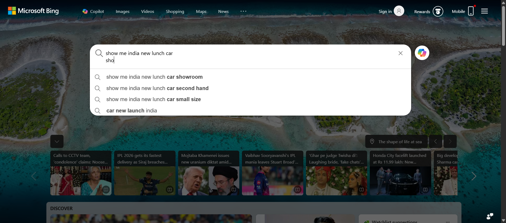

# Selenium Google Search Automation 🚀

A beginner-friendly browser automation project built using Python and Selenium WebDriver.

This project automatically opens a browser, performs a search based on user input, captures a screenshot of the results, and stores search history locally.

---

## Features

- Automated browser control using Selenium
- Dynamic user search input
- Automatic screenshot capture
- Dynamic screenshot file names
- Search history logging
- Error handling
- Chrome browser automation

---

## Technologies Used

- Python
- Selenium
- Chrome WebDriver

---

## Project Structure

```text
selenium-google-search/
│
├── screenshots/
│   ├── output.png
│   ├── flower_image.png
│
├── history.txt
├── search.py
├── requirements.txt
├── .gitignore
└── README.md
```

---

## Installation

Clone the repository:

```bash
git clone https://github.com/ashishsahoo18/selenium-google-search.git
```

Move into the project folder:

```bash
cd selenium-google-search
```

Install dependencies:

```bash
pip install -r requirements.txt
```

---

## Run the Project

```bash
python search.py
```

---

## Example Workflow

1. User enters search text
2. Browser opens automatically
3. Search executes automatically
4. Results page loads
5. Screenshot is captured
6. Search history is stored
7. Browser closes automatically

---

## Example Output

### Search Screenshot



---

## Example Search History

```text
2026-05-22 05:55:20 - what is intensity
2026-05-22 05:57:10 - give me a flower image
```

---

## Requirements

```txt
selenium
```

---

## Future Improvements

- Firefox browser support
- Headless browser mode
- GUI interface
- Multiple search engines
- Automatic PDF export
- AI-based search suggestions

---

## Author

Ashish Sahoo

GitHub: https://github.com/ashishsahoo18