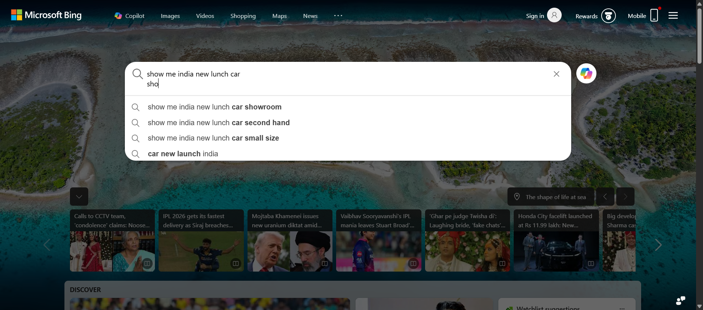

# 🔎 Selenium Browser Search Automation

A Python-based browser automation tool built with **Selenium WebDriver**. The project allows users to perform automated web searches using Chrome or Firefox, capture screenshots of the results, and maintain a local search history.

> A practical Selenium project demonstrating browser automation, user input handling, screenshot management, and basic automation logging.

---

## 🚀 Features

* 🌐 **Multi-Browser Support** – Choose between Chrome and Firefox.
* 🔎 **Automated Search** – Enter a search query and let Selenium perform it automatically.
* 📸 **Automatic Screenshots** – Saves a screenshot after the search is completed.
* 🕒 **Timestamped Files** – Each screenshot receives a unique timestamp.
* 📋 **Search History** – Stores search queries, timestamps, and result URLs.
* 📁 **Automatic Folder Creation** – Creates the screenshots directory when required.
* 🛡️ **Error Handling** – Handles unexpected Selenium errors gracefully.
* 🔄 **Automatic Browser Cleanup** – Closes the browser after the operation finishes.

---

## 🛠️ Tech Stack

| Technology   | Purpose                   |
| ------------ | ------------------------- |
| Python       | Core programming language |
| Selenium     | Browser automation        |
| Chrome       | Supported browser         |
| Firefox      | Supported browser         |
| Git & GitHub | Version control           |

---

## 📂 Project Structure

```text
selenium-google-search/
│
├── screenshots/
│   └── search_results.png
│
├── search.py
├── config.py
├── history.txt
├── requirements.txt
├── .gitignore
└── README.md
```

---

## ⚙️ Installation

### 1. Clone the repository

```bash
git clone https://github.com/ashishsahoo18/selenium-google-search.git
```

### 2. Open the project

```bash
cd selenium-google-search
```

### 3. Install dependencies

```bash
pip install -r requirements.txt
```

---

## ▶️ Run the Project

Start the automation tool:

```bash
python search.py
```

The program will ask for a search query:

```text
Enter search text: Python Selenium
```

Then select your browser:

```text
Choose browser (chrome/firefox): chrome
```

Selenium will automatically open the selected browser and perform the search.

---

## 🔄 How It Works

```text
User enters search query
          ↓
User selects browser
          ↓
Selenium starts browser
          ↓
Search query is entered
          ↓
Search results are loaded
          ↓
Screenshot is captured
          ↓
Search history is saved
          ↓
Browser closes
```

---

## 📸 Screenshots

Example project output:



Screenshots are automatically saved inside:

```text
screenshots/
```

Example:

```text
python_selenium_20260820_053000.png
```

---

## 📋 Search History

The project stores search activity locally in:

```text
history.txt
```

Example:

```text
2026-08-20 05:30:00 | Python Selenium | https://www.bing.com/search?q=Python+Selenium
```

This records:

* Date and time
* Search query
* Result URL

---

## 🌐 Browser Support

Currently supported:

| Browser | Status      |
| ------- | ----------- |
| Chrome  | ✅ Supported |
| Firefox | ✅ Supported |

Selenium Manager automatically manages the required browser drivers in modern Selenium versions.

---

## 🧪 Example

```text
Enter search text: What is Python?

Choose browser (chrome/firefox): firefox

Opening browser...
Searching...
Screenshot saved!
Search history updated!
Completed successfully!
Closing browser...
```

---

## 🧠 What I Learned

This project helped me practice:

* Python programming
* Selenium WebDriver
* Browser automation
* Web element locating
* Keyboard interaction
* File handling
* Exception handling
* Date and time handling
* Dynamic file naming
* Multi-browser automation
* Git and GitHub workflow

---

## 🔮 Future Improvements

Planned improvements include:

* [ ] GUI interface
* [ ] Headless browser mode
* [ ] Multiple search-engine support
* [ ] Automated test cases
* [ ] Better logging system
* [ ] Configuration-based browser selection
* [ ] Search result extraction
      

---

## 🐛 Issues & Contributions

If you find a bug or have an idea for improvement, open an **Issue** in this repository.

Pull requests and suggestions are welcome.

---

## 👨‍💻 Author

**Ashish Sahoo**

Python Developer | Automation | Backend Development

GitHub:
https://github.com/ashishsahoo18

---

## ⭐ Support

If you find this project useful, consider giving the repository a ⭐ on GitHub.
